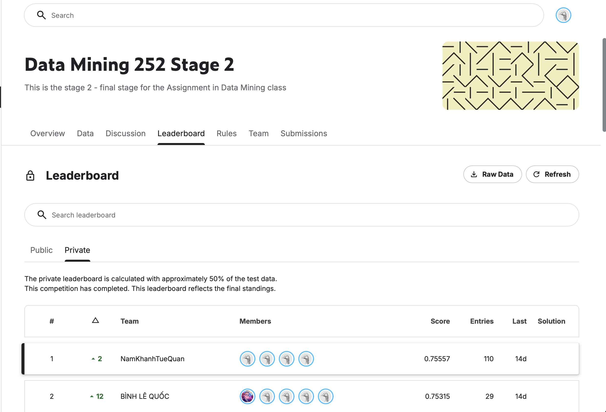

# 📚 Scholarly Label Predictor

> **Data Mining (CO3117 / 252) — Ho Chi Minh University of Technology (HCMUT)**
>
> 🏆 **ACHIEVEMENT: TOP 1 LEADERBOARD (Score: 0.75557 QWK)** 🏆
>
> 🔗 Competition: [Kaggle — Data Mining 252 Stage 2](https://www.kaggle.com/competitions/data-mining-252-stage-2/overview)
>
> An advanced NLP and data mining pipeline designed to classify research papers in the field of Answer Set Programming (ASP) into ordinal categories.

## 🏆 Final Leaderboard Result

The final SciBERT-based pipeline achieved **Rank #1** on the private leaderboard with a score of **0.75557 QWK**.

<p align="center">
  
</p>
## 🎯 Problem Statement

Predict the **category label** (`Label`, integer from 1–5) of research papers based on their metadata and text content. This is a **supervised ordinal classification** task, evaluated using **Quadratic Weighted Kappa (QWK)** — which penalizes larger prediction errors more heavily.

### Key Results

- 🥇 Rank #1 / 35 teams
- 📈 Private Leaderboard: 0.75557 QWK
- 🤖 Final Model: SciBERT Dual-Head Architecture
- 🔍 External abstract crawling from 4 academic APIs
- 📚 End-to-end pipeline from data collection → feature engineering → model training

### Dataset

| Split | Samples | Labels |
|---|---|---|
| Train (Stage 2) | 2,494 | ✅ available |
| Public test (Stage 2) | 298 | ❌ not available |
| Private test (Stage 2) | 298 | ❌ not available |

Each paper includes: `id`, `Title`, `Authors`, `Venue`, `Year`, `DOI/Link`, `Label`.

> **Key challenge**: the original dataset has **no abstracts** — abstracts were crawled from external APIs to enrich the data.

### Submission Format
```csv
id,Label
2491,1
2707,3
...
```

---

## 🗂️ Repository Structure

```text
Scholarly-Label-Predictor/
│
├── data/
│   ├── raw/
│   │   ├── Stage1/                        # Stage 1 data (original train + test)
│   │   └── Stage2/                        # Stage 2 data (official competition)
│   │
│   ├── external/
│   │   └── crawled_abstracts.csv          # Abstracts crawled from external APIs
│   │
│   ├── interim/                           # Intermediate processed data
│   │   ├── cleaned_train.csv
│   │   ├── cleaned_test.csv
│   │   ├── merged_train.csv               # After merging crawled abstracts into train
│   │   └── merged_test.csv                # After merging crawled abstracts into test
│   │
│   ├── processed/                         # Precomputed features saved to disk
│   │   ├── train_SBERT.npy                # Raw SBERT embeddings (train)
│   │   ├── test_SBERT.npy                 # Raw SBERT embeddings (test)
│   │   ├── train_SBERT_features.npy       # SBERT + metadata features (train)
│   │   ├── test_SBERT_features.npy        # SBERT + metadata features (test)
│   │   ├── train_SVM_features.npz         # TF-IDF sparse matrix (train)
│   │   ├── test_SVM_features.npz          # TF-IDF sparse matrix (test)
│   │   └── train_labels.csv
│   │
│   └── submission/                        # All generated submission files
│       ├── submission_baseline_svm.csv
│       ├── submission_sbert_xgboost.csv
│       ├── submission_bert.csv
│       └── submission_final.csv           # Final Top-1 submission file
│
├── notebooks/                             # Jupyter notebooks following the pipeline order
│   ├── 01_eda.ipynb                       # Exploratory Data Analysis
│   ├── 02_crawl_abstract.ipynb            # Crawl abstracts from APIs
│   ├── 02.5_proprocess.ipynb              # Preprocessing & data merging
│   ├── 03_feature_engineering.ipynb       # Feature engineering (TF-IDF, SBERT, metadata)
│   ├── 04_baseline_tfidf_svm.ipynb        # Baseline: TF-IDF + SVM / LogReg / Naive Bayes
│   ├── 04.5_sbert_lightgbm.ipynb          # SBERT embeddings + LightGBM
│   ├── 04.5_sbert_test_data.ipynb         # Generate SBERT features for test set
│   ├── 05_sbert_xgboost.ipynb             # SBERT + XGBoost
│   └── 06_bert_scibert.ipynb              # Fine-tune SciBERT (FINAL WINNING MODEL)
│
├── src/
│   ├── crawler/                           # Multi-source abstract crawling module
│   │   ├── crawler.py                     # BaseCrawler (abstract base class)
│   │   ├── semantic_scholar_api.py        # Semantic Scholar API crawler
│   │   ├── crossref_api.py                # CrossRef API crawler
│   │   ├── openalex_api.py                # OpenAlex API crawler
│   │   ├── doi_resolver_api.py            # DOI → metadata resolver
│   │   └── fallback_crawler.py            # Fallback when all APIs fail
│   │
│   ├── preprocess/
│   │   └── preprocess.py                  # DataMerger, MissingHandler, AuthorNormalizer, TextCleaner
│   │
│   ├── features/                          # Feature extraction modules
│   │   ├── tfidf_features.py              # TF-IDF for title, abstract, authors (scikit-learn)
│   │   ├── sbert_features.py              # SBERT encoder (all-mpnet-base-v2)
│   │   └── metadata_features.py           # Metadata features (venue, year, ...)
│   │
│   ├── models/                            # Model training scripts
│   │   ├── train_svm.py                   # SVM (baseline)
│   │   ├── train_xgboost.py               # XGBoost
│   │   ├── train_lightgbm.py              # LightGBM
│   │   ├── train_bert.py                  # SciBERT Dual-Head Pipeline Implementation
│   │   └── ensemble.py                    # Multi-model ensembling module
│   │
│   └── utils/
│       └── utils.py                       # Utility functions
│
├── config.py                              # Paths and hyperparameter configuration
├── requirements.txt
└── README.md
```

---

## 🔄 Pipeline Overview

```text
Raw Data (Stage 2)
       │
       ▼
[02_crawl_abstract]  ──► Crawl abstracts from Semantic Scholar / CrossRef / OpenAlex / DOI
       │
       ▼
[02.5_preprocess]    ──► Merge abstracts, handle missing values, normalize authors, clean text
       │
       ▼
[03_feature_eng]     ──► TF-IDF (title + abstract + authors) | SBERT embeddings | Metadata features
       │
       ├──► [04_baseline]       TF-IDF + SVM / LogReg / Naive Bayes
       ├──► [04.5 / 05]         SBERT + LightGBM / XGBoost / KNN / LogReg
       └──► [06_bert_scibert]   Winning Model: Fine-tuned SciBERT Dual-Head (5-fold CV)
                │
                ▼
       submission_final.csv
```

---

## 🧩 Component Details

### Abstract Crawling (`src/crawler/`)

Since the original dataset contains no abstracts, a multi-source crawling system was built around a `BaseCrawler` abstract class with five implementations:

- **Semantic Scholar API** — primary source
- **CrossRef API** — first fallback via DOI
- **OpenAlex API** — second fallback
- **DOI Resolver** — direct DOI resolution
- **Fallback Crawler** — handles remaining cases

Normalized output: `{ id, doi, abstract, crawled_authors }`

### Preprocessing (`src/preprocess/preprocess.py`)

Four transformer classes following the sklearn API:

- `DataMerger` — left-joins crawled abstracts into the base dataframe on `id`
- `MissingHandler` — fills NaN values for title, abstract, authors, venue, and year
- `AuthorNormalizer` — normalizes author names (removes special characters, preserves Unicode)
- `TextCleaner` — lowercases text, strips URLs and special characters, normalizes whitespace

### Feature Engineering (`src/features/`)

**TF-IDF** (`tfidf_features.py`):
- Title TF-IDF: `max_features=3000`, ngram range `(1,2)`
- Abstract TF-IDF: `max_features=8000`, ngram range `(1,2)`
- Author TF-IDF: `max_features=1500`, ngram range `(1,1)`, last name only
- Output: sparse matrix (`.npz`), concatenated via `scipy.sparse.hstack`

**SBERT** (`sbert_features.py`):
- Model: `all-mpnet-base-v2`
- Input format: `"Title: {title} [SEP] Abstract: {abstract} Authors: {authors} Venue: {venue} Year: {year}"`
- Output: 768-dimensional dense embedding vectors (`.npy`)

### Models Overview

| Model | Features | Notebook / Script |
|---|---|---|
| SVM (baseline) | TF-IDF (title + abstract + authors) | `train_svm.py` / `04_baseline_tfidf_svm.ipynb` |
| XGBoost | SBERT embeddings | `train_xgboost.py` / `05_sbert_xgboost.ipynb` |
| LightGBM | SBERT embeddings | `train_lightgbm.py` / `04.5_sbert_lightgbm.ipynb` |
| **SciBERT** (Winner) | Raw text prompt (engineered metadata + text) | `train_bert.py` / `06_bert_scibert.ipynb` |

---

## 🧠 The Winning Model: SciBERT Dual-Head Architecture (`src/models/train_bert.py`)

The final submission achieving **Top 1 Leaderboard (0.75557 QWK)** relies on a highly customized deep learning pipeline built using `allenai/scibert_scivocab_uncased`. Below is the complete technical breakdown of the production architecture implemented in `train_bert.py`.

### 1. Robust Environment & Thread Control
To ensure stable execution over long distributed training iterations without performance drops or resource limits, the OS environment is explicitly decoupled from multi-threaded bottlenecks:
```python
os.environ["OMP_NUM_THREADS"] = "1"
os.environ["TOKENIZERS_PARALLELISM"] = "false"
```
This isolates the Stratified 5-Fold loops, eliminating scheduling overheads and high context-switching costs.

### 2. Multi-Context Prompt Engineering & Tokenization
Text attributes are combined into a dense semantic format via custom separator tracking. To conserve contextual relationships while handling multi-author sets, names are limited to the first 3 primary contributors with an appended short suffix if truncated:
Prompt:
```text
Title [SEP] Abstract [SEP] year: {year}, authors: {authors_short}
```

The data is wrapped inside a custom PyTorch `PaperDataset` paired with a `dynamic_collate_fn`. Instead of zero-padding every batch globally to a fixed `max_length=256`, sequences are padded dynamically via `nn.utils.rnn.pad_sequence` based on the longest element *within that specific batch*, optimizing VRAM consumption and minimizing dead padding compute.

### 3. Dual-Head Architecture with Multi-Sample Dropout
Rather than approaching this purely as a classification or regression task, `BERTOrdinalRegressor` implements a multi-objective pooling method:

```text
                            [SciBERT Encoder Stack]
                                       │
                                       ▼
                       [Token Output Representation Matrix]
                                  ┌────┴────┐
                                  ▼         ▼
                             [CLS Token] [Mean Pooled Sequence]
                                  └────┬────┘
                                       ▼
                         [Concatenated Vector (Hidden * 2)]
                                       │
                                       ▼
                         [Multi-Sample Dropout Ensemble]
                           (5 parallel paths, p=0.1 to 0.5)
                                  ┌────┴────┐
                                  ▼         ▼
                       [Ordinal Head]     [Cross-Entropy Head]
                          (4 outputs)         (5 outputs)
```

* **Feature Representation:** The model extracts the standard `[CLS]` token and concatenates it with a length-masked sequence `mean_pooled` vector, doubling the feature space dimension ($768 \times 2 = 1536$).
* **Multi-Sample Dropout:** The representation passes through 5 parallel dropout paths with linearly spaced dropout probabilities ($p \in [0.1, 0.5]$). The outputs are averaged before arriving at the heads, creating an internal ensemble effect that smooths the loss landscape.
* **Dual Heads:**
  1. **Ordinal Head:** Outputs 4 logits predicting binary cutoffs using **Frank-Hall Binary Decomposition** targets. For a true label $y \in \{1, 2, 3, 4, 5\}$, the target vector elements are defined as:
     $$t_i = \begin{cases} 1.0 & \text{if } y > i \\ 0.0 & \text{otherwise} \end{cases} \quad \text{for } i \in \{1, 2, 3, 4\}$$
  2. **Cross-Entropy Head:** Outputs 5 standard logits mapping to raw class indexes ($0 \rightarrow 4$).

### 4. Hybrid Objective Optimization & Adversarial Training
The training engine monitors an aggregate multi-task objective function. Extreme label imbalance is managed by calculating inverse class frequency frequencies, producing normalized `sample_weights` applied directly across elements:
$$\text{Loss}_{\text{Total}} = \alpha \cdot \text{Loss}_{\text{Ordinal}} + \beta \cdot \text{Loss}_{\text{CE}} \quad (\alpha=0.7, \; \beta=0.3)$$
Where $\text{Loss}_{\text{Ordinal}}$ uses `BCEWithLogitsLoss` and $\text{Loss}_{\text{CE}}$ uses `CrossEntropyLoss`.

To stabilize convergence against noise in crawled text, **Adversarial Training via the Fast Gradient Method (FGM)** is executed during every training pass:
1. Calculates standard forward loss gradients.
2. Injects an embedding perturbation step: $\delta = \epsilon \cdot \frac{\nabla_{\text{emb}} \text{Loss}}{\|\nabla_{\text{emb}} \text{Loss}\|} \quad (\epsilon = 0.2)$.
3. Computes an adversarial backward loss step with perturbed embeddings before evaluating the optimizer steps.

### 5. Layer-Wise Learning Rate Decay (LLRD)
A custom optimizer routine maps decoupled parameters backward through the transformer layers. Higher encoder layers receive greater learning rates, while earlier layers are tightly bounded to preserve pretrained structural insights. Weight decay ($0.01$) is strictly bypassed for all biases and `LayerNorm.weight` tensors:
$$\eta_{\text{layer}_l} = \eta_{\text{base}} \cdot \alpha^{L - l} \quad (\alpha = 0.95, \; \eta_{\text{base}} = 2\text{e-}5)$$

```text
[Output Heads] ───────────────► Full Learning Rate (2e-5)
[Transformer Layer 11] ───────► 2e-5 * 0.95^1  = 1.90e-5
[Transformer Layer 10] ───────► 2e-5 * 0.95^2  = 1.81e-5
...
[Embeddings Layer] ───────────► 2e-5 * 0.95^13 = 1.02e-5
```
The network is scheduled across epochs using a `OneCycleLR` learning rate policy with a $10\%$ linear warmup phase.

### 6. Expected Value Blending & Joint Metric Thresholding
During evaluation, raw outputs from both heads are combined to generate a refined continuous score:
* **Ordinal Expected Value ($EV_{\text{ord}}$):** $1.0 + \sum_{i=1}^{4} \sigma(\text{logit}_{\text{ord}, i})$
* **Cross-Entropy Expected Value ($EV_{\text{ce}}$):** $\sum_{c=0}^{4} (c + 1) \cdot \text{softmax}(\text{logit}_{\text{ce}, c})$
* **Blended Prediction:** $EV_{\text{blend}} = \gamma \cdot EV_{\text{ord}} + (1 - \gamma) \cdot EV_{\text{ce}} \quad (\gamma = 0.6)$

The continuous Out-Of-Fold ($EV_{\text{blend}}$) predictions are mapped back into discrete categories $\{1, 2, 3, 4, 5\}$ using a custom `OptimizedRounder`. Instead of relying on rigid, default boundaries, the **Nelder-Mead simplex algorithm** (`scipy.optimize.minimize`) explicitly optimizes decision thresholds to maximize a balanced cost objective:
$$\text{Loss}_{\text{Rounder}} = - \left( (1 - w_{\text{f1}}) \cdot \text{QWK} + w_{\text{f1}} \cdot \text{Macro F1} \right) \quad (w_{\text{f1}} = 0.4)$$
This strategy dynamically shifts decision thresholds away from dominant classes, protecting minority categories and directly driving up global Quadratic Weighted Kappa scores.

---

## ⚙️ Installation

**Requirements**: Python 3.9+

```bash
git clone https://github.com/nnam128/Scholarly-Label-Predictor.git
cd Scholarly-Label-Predictor

python -m venv venv
source venv/bin/activate      # Linux/macOS
venv\Scripts\activate         # Windows

pip install -r requirements.txt
```

---

## 🚀 Usage

Run the notebooks in order:

```bash
jupyter notebook
```

1. `02_crawl_abstract.ipynb` — crawl abstracts (skip if `crawled_abstracts.csv` already exists)
2. `02.5_proprocess.ipynb` — merge and clean data
3. `03_feature_engineering.ipynb` — generate and save features
4. `04_baseline_tfidf_svm.ipynb` → `05_sbert_xgboost.ipynb` → `06_bert_scibert.ipynb` — train models

To run SciBERT with GPU:
```bash
# Check CUDA availability
python -c "import torch; print(torch.cuda.is_available())"
```

---

## 📦 Tech Stack

| Category | Libraries |
|---|---|
| Data processing | `pandas`, `numpy`, `scipy` |
| Crawling | `requests`, `beautifulsoup4`, `httpx` |
| Feature extraction | `scikit-learn` (TF-IDF), `sentence-transformers` (SBERT) |
| Gradient boosting | `xgboost`, `lightgbm` |
| Deep learning | `torch`, `transformers` (HuggingFace SciBERT) |
| Visualization | `matplotlib`, `seaborn` |
| Notebooks | `jupyter`, `ipykernel` |

---

## 🏫 Course Information

| | |
|---|---|
| Course | Data Mining — CO3117 / 252 |
| University | Ho Chi Minh University of Technology (HCMUT) |
| Evaluation metric | Quadratic Weighted Kappa (QWK) |
| Competition | 2 stages (Stage 1: exploration, Stage 2: official) |

---

## 👥 Author

**nnam128** — [GitHub](https://github.com/nnam128)
```